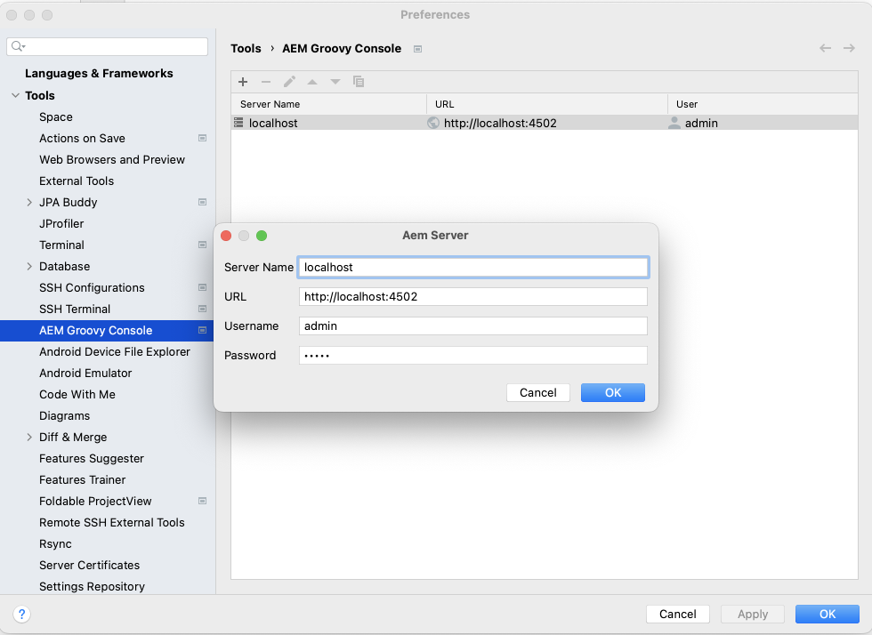
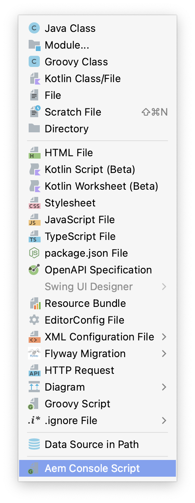
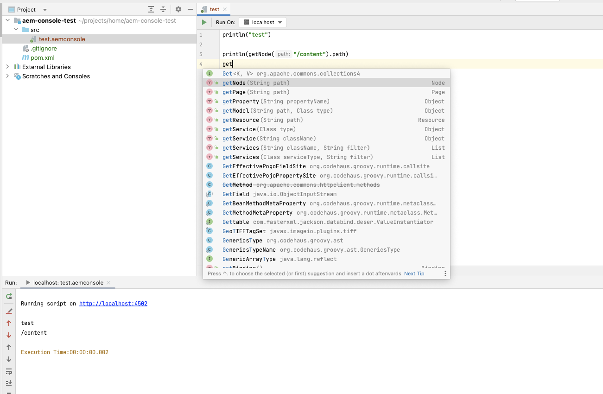
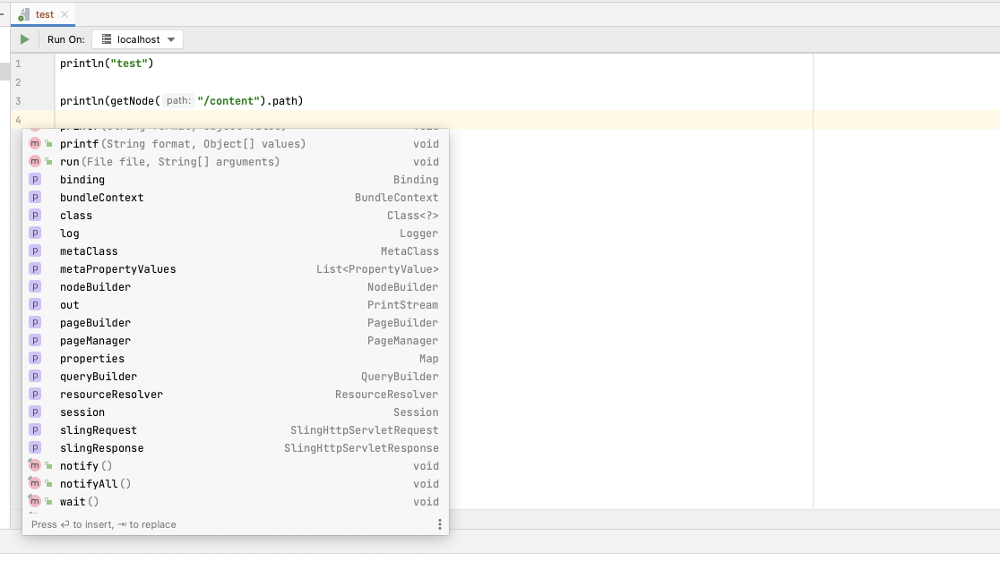

# AEM Groovy Console IntelliJ Plugin
<!-- Plugin description -->
Adds support to run groovy scripts on AEM server from Intellij IDEA.

Powered by [AEM Groovy Console](https://github.com/OlsonDigital/aem-groovy-console).

## Features

- Execute groovy scripts on running AEM server from editor
- Script can be executed on multiple servers
- Console output provides a link to the script's source if exception occurred
- Support code completion in groovy editor. **Note**: com.adobe.aem:uber-jar:x.x.x should be in project classpath to provide full code completion
<!-- Plugin description end -->

## How to use
AEM Servers should be configured in Settings tab

                       
Plugin applied to any *.aemconsole* file

Code completion support

