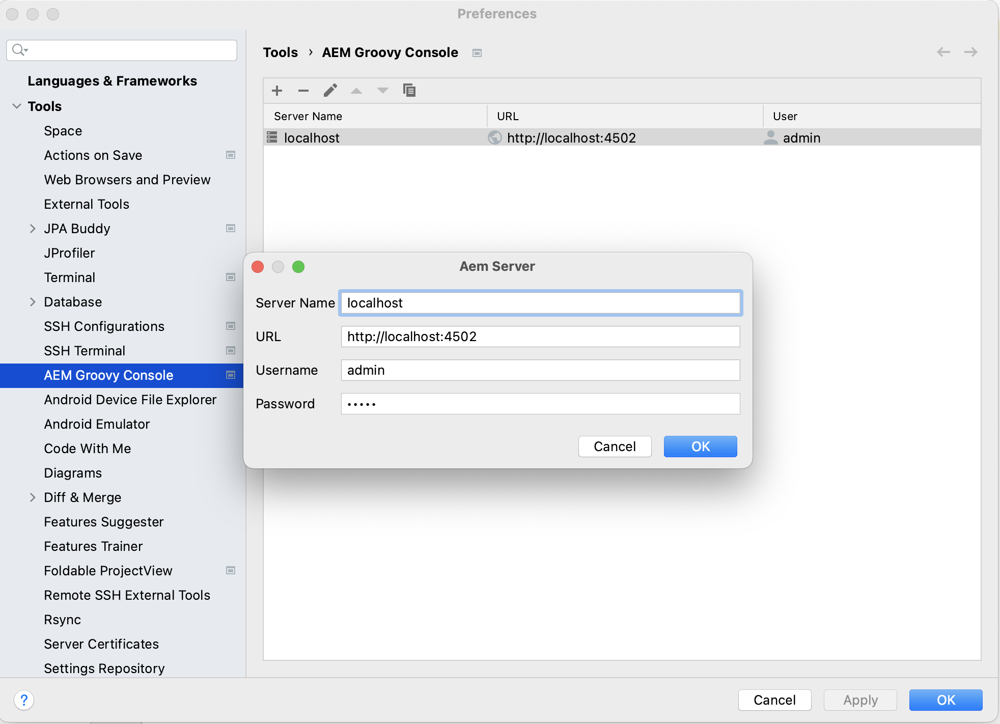
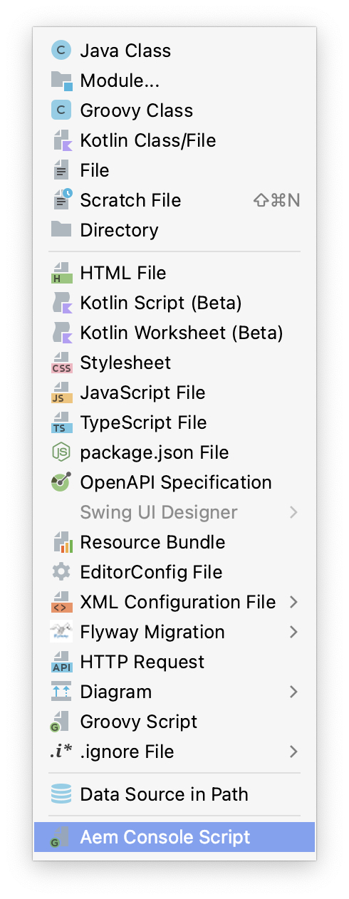
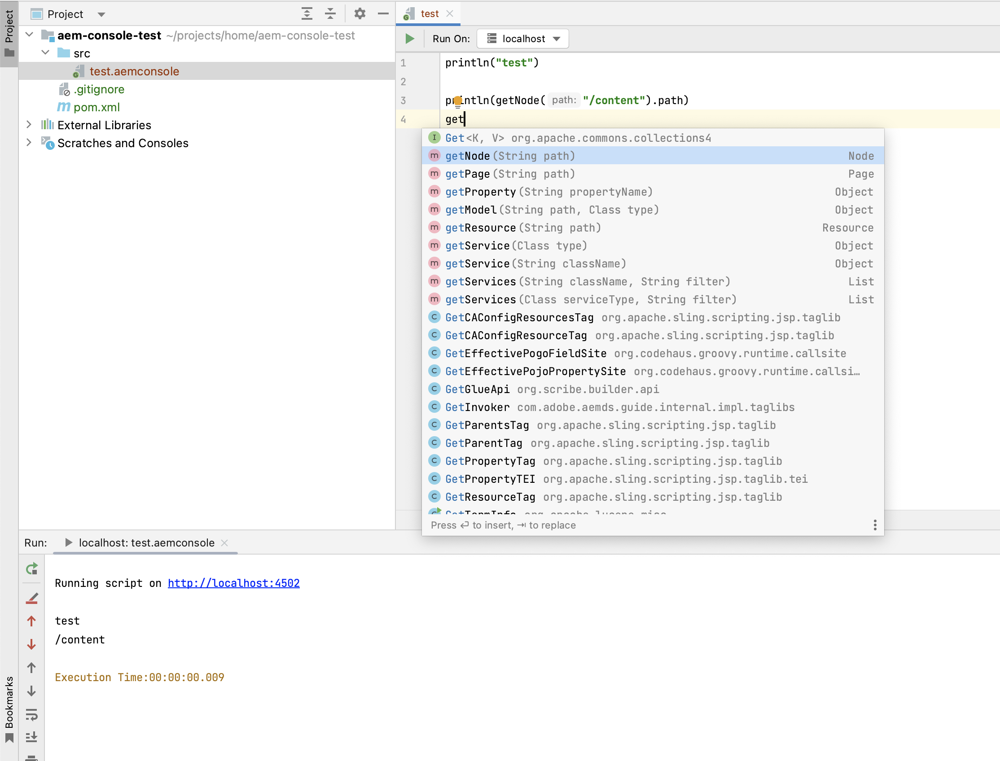
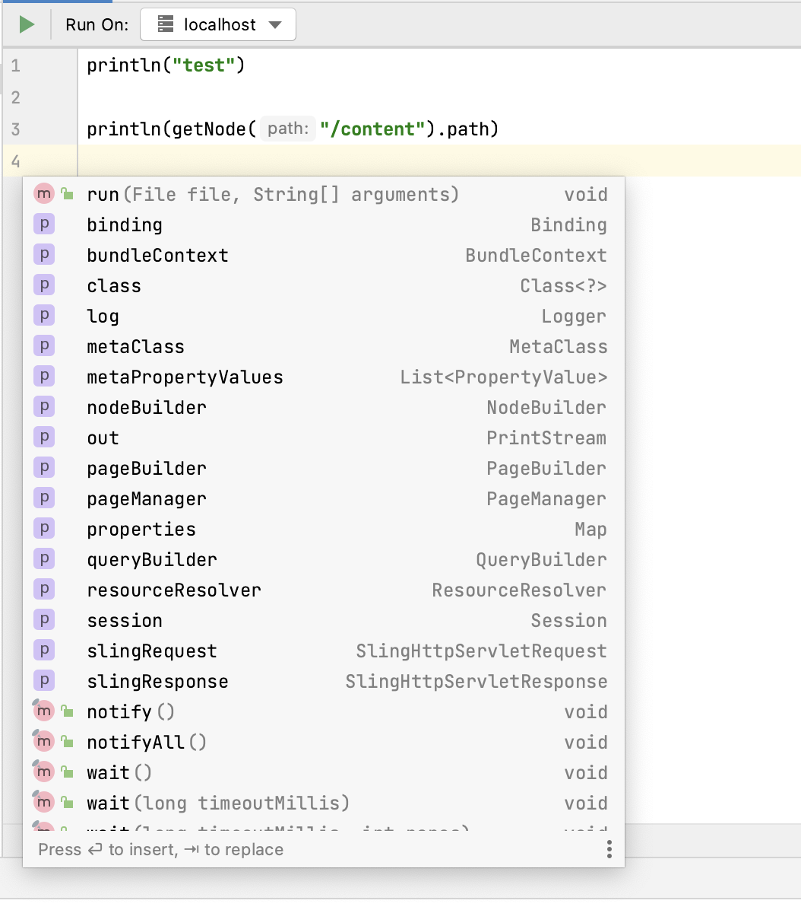

# AEM Groovy Console IntelliJ Plugin
<!-- Plugin description -->
Adds support to run groovy scripts on AEM server from Intellij IDEA.

Powered by [AEM Groovy Console](https://github.com/OlsonDigital/aem-groovy-console).

## Features

- Execute groovy scripts on running AEM server from editor
- Script can be executed on multiple servers
- Console output provides a link to the script's source if exception occurred
- Support code completion in groovy editor. **Note**: com.adobe.aem:uber-jar:x.x.x should be in project classpath to provide full code completion
- [More Details](https://github.com/bobi/aem-groovyconsole-plugin)
<!-- Plugin description end -->

## How to use
* Configure AEM Server Settings tab

       
* Add Groovy Framework support into your project
* Add AEM uber-jar into project classpath
* Create new *.aemconsole* file

### Code completion support

            
## Usage Example
readme/usage.mp4

## How to get?

You can download it from [JetBrains Marketplace](https://plugins.jetbrains.com/plugin/19633-aem-groovy-console) or directly in
your Intellij Idea by searching for "AEM Groovy Console".